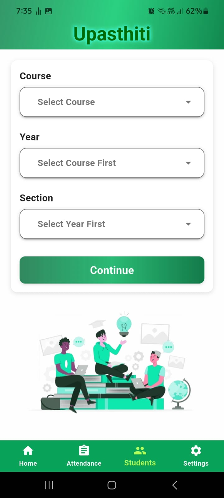
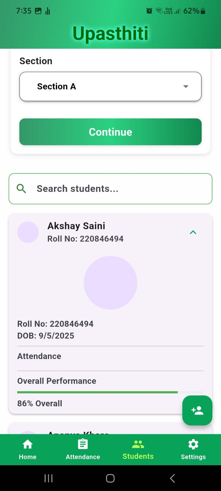
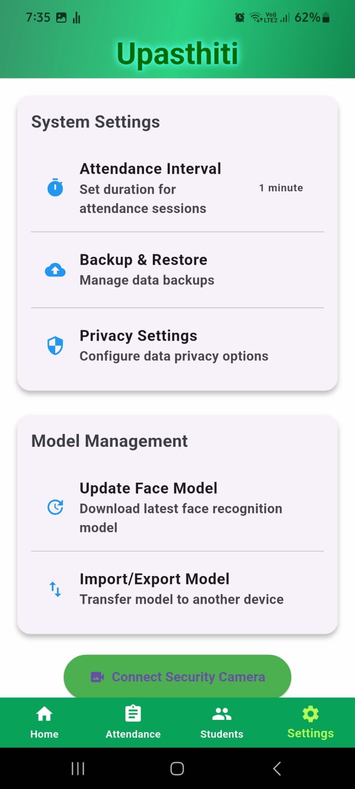

# 📷 Upasthiti – Face Recognition Attendance System

*Upasthiti* is a real-time Face Recognition Attendance System for colleges and universities, built using *Flutter* (frontend), *Python FastAPI* (backend), and *MongoDB* (database). It automates attendance marking using AI-based facial recognition to improve efficiency, accuracy, and user convenience.

---

## 🛠 Tech Stack

- *Frontend:* Flutter (Dart)
- *Backend:* Python FastAPI
- *Database:* MongoDB
- *AI/ML:* OpenCV + DeepFace

---

## 🚀 Features

- 🔍 75%+ Face Recognition Accuracy (Tested in real-world scenarios)
- ⏱ Attendance time reduced from 10 minutes to under 1 minute
- 🧑‍🏫 Role-based access: Admin, Teacher
- 🔐 Secure API communication & data storage
- 📊 Class-wise & date-wise attendance records
- 🖼 Real-time image capture & validation

---

## 📂 Project Screenshots

## 📈 Results & Impact
✅ Tested with 100+ students and faculty in a real college environment

⏱ Attendance time reduced by 90% (from 10 mins to <1 min/class)

🔒 Maintained secure and accurate data logs via MongoDB
